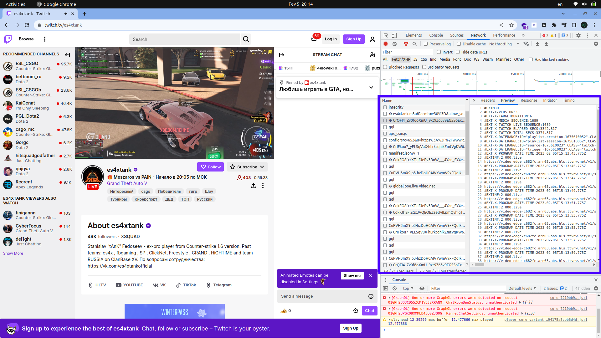

HLS protokoli nima va u qanday ishlaydi?
==============================
HLS HTTP Live Streaming ma'noni anglatadi. Qisqa qilib aytadigan bo'lsak HLS bu visual
va audio medialarni foydalanuvchilarga internet orqali uzatadigan media streaming protokoldir.
Apple bu protokolni 2009-yilda ishlab chiqdi.

HLS qanday ishlaydi?
-------------------
Odatda jonli efir jarayoni quyidagicha amalga oshiriladi:

1. Kamera orqali video kontent yaratiladi.
2. Bu kontent encoder'ga yuboriladi.
3. Encoder bu kontentni RTMP(Real Time Messaging Protocol) protokoli orqali serverga yuboradi.
4. Server bu kontentni foydalanuvchilarga uzatadi.

HLS protokolining texnik ko'rinishi
----------------------------------
HLS protokoli texnologiyasi qanday ishlaydi?

- HLS protokoli video faylni .ts formatida bo'lgan qisqa (10soniya) segmentlarga ajratadi.
- Server bu fayllarni saqlaydi va HTTP bu bo'laklarni foydalanuvchilarga yetkazib beradi.
- HLS H.264 yoki HEVC/H.265 kodeklari bilan kodlangan videoni ko'rsatadi.
- HLS protokoli audio fayllarni MPEG-2 Audio Layer 3 (MP3) yoki Advanced Audio Coding (AAC) formatida kodlangan fayllar
  bilan ko'rsatadi.
- HLS protokoli video va audio fayllarni bir-biriga bog'lash uchun Media Playlist fayllaridan foydalanadi.
- Media Playlist fayllari .m3u8 formatida saqlanadi.

HLS protokolini ishlatishning foydali tomonlari
-----------------------------------------------
HLS protokolini ishlatib biz quyidagi imkoniyatlarga ega bo'lamiz:

- Kengaytirilgan video player (rezolutsiya va ijro tezligi imkoniyatlari bilan)
- Bir nechta transkodlash variantlari (bir nechta o'lchamlar: 240p, 360p, 480p, 720p, 1080p; bir nechta video zichlash
  variantlari: h264, h265, vp9)
- Subtitrlar (ko'p tilli subtitr fayllarini ishlatish imkoniyati)
- Bo'laklangan fayllar (Kontentni internet tezligi unchalik tez bo'lmagan foydalanuvchilar ham ko'ra olish imkoniyati)

Va bulardan tashqari yana ko'plab imkoniyatlar mavjud. Men bilganlarim hozircha shular 🙂

Ba'zi video streaming platformalaridan misollar:
------------------------------------------------


Masalan dunyoga mashhur gaming platformasi Twitch bu protokolni ishlatadi. Twitch bu protokolni ishlatish uchun
video va audio fayllarni MPEG-2 Transport Stream (MPEG-TS) formatida kodlangan fayllar bilan ko'rsatadi.
Twitch bu fayllarni 10 soniya bo'lgan segmentlarga ajratadi va Media Playlist fayllaridan foydalanadi.
Twitch bu protokolni ishlatish uchun 3 tayinlangan Media Playlist fayllaridan foydalanadi:

- Master Playlist fayli
- Video Playlist fayli
- Audio Playlist fayli

Master Playlist fayli
---------------------
Master Playlist fayli bu protokolning asosiy faylidir. Bu fayl video va audio fayllarni bir-biriga bog'lash uchun
ishlatiladi. Master Playlist fayli .m3u8 formatida saqlanadi. Bu fayl quyidagi ko'rinishda bo'lishi mumkin:

```
#EXTM3U
#EXT-X-STREAM-INF:PROGRAM-ID=1,BANDWIDTH=1280000,RESOLUTION=640x360
video_360p.m3u8
#EXT-X-STREAM-INF:PROGRAM-ID=1,BANDWIDTH=2560000,RESOLUTION=842x480
video_480p.m3u8
#EXT-X-STREAM-INF:PROGRAM-ID=1,BANDWIDTH=7680000,RESOLUTION=1280x720
video_720p.m3u8
#EXT-X-STREAM-INF:PROGRAM-ID=1,BANDWIDTH=6500000,RESOLUTION=1920x1080
video_1080p.m3u8
```

Video Playlist fayli
--------------------
Video Playlist fayli video fayllarni bir-biriga bog'lash uchun ishlatiladi. Bu fayl .m3u8 formatida saqlanadi.
Bu fayl quyidagi ko'rinishda bo'lishi mumkin:

```
#EXTM3U
#EXT-X-VERSION:3
#EXT-X-TARGETDURATION:10
#EXT-X-MEDIA-SEQUENCE:0
#EXTINF:10.000,
video_360p_000.ts
#EXTINF:10.000,
video_360p_001.ts
#EXTINF:10.000,
video_360p_002.ts
#EXTINF:10.000,
video_360p_003.ts
```

Audio Playlist fayli
--------------------
Audio Playlist fayli audio fayllarni bir-biriga bog'lash uchun ishlatiladi. Bu fayl .m3u8 formatida saqlanadi.
Bu fayl quyidagi ko'rinishda bo'lishi mumkin:

```
#EXTM3U
#EXT-X-VERSION:3
#EXT-X-TARGETDURATION:10
#EXT-X-MEDIA-SEQUENCE:0
#EXTINF:10.000,
audio_360p_000.ts
#EXTINF:10.000,
audio_360p_001.ts
#EXTINF:10.000,
audio_360p_002.ts
#EXTINF:10.000,
audio_360p_003.ts
```

Quyidagi screenshot Twitch platformasidan olingan Video Playlist fayli va Audio Playlist fayli:



Bu screenshot'da esa Master Playlist faylidagi medialarni (.ts formatda) olayotganini ko'ramiz:


